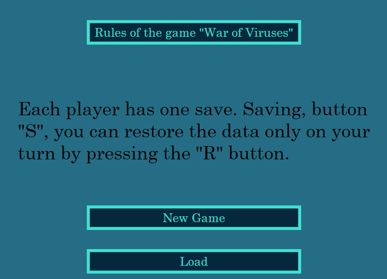
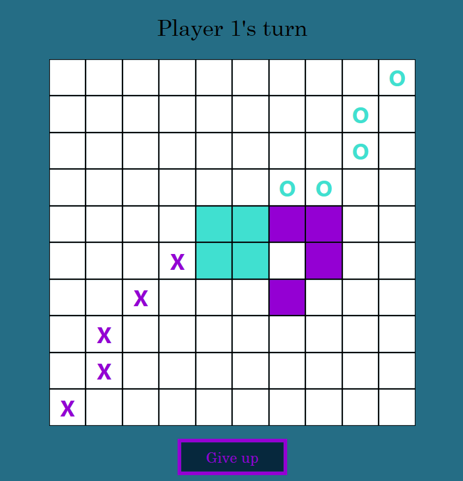
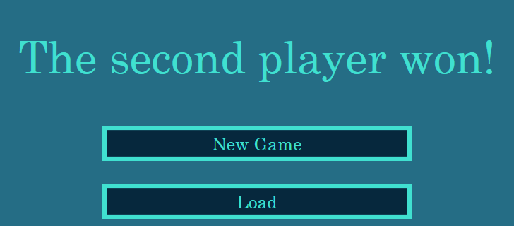
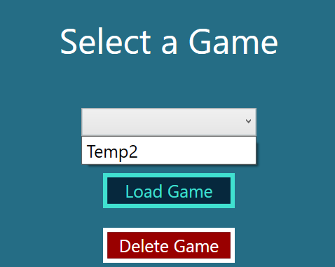

# ViruseWar
A logic game for two with saves and easy rules described in the start window.

## How to start?
1. Install Visual Studio and C# with .NET 8.0 version.
2. Install [MSSQL](https://www.microsoft.com/ru-ru/download/details.aspx?id=101064) and select "Basic" download.
3. Just run the code using the button inside VS like a regular project.

## Screenshots of the gameplay

### Start Window

### Game Process

### Endgame Screen

### Load Window

